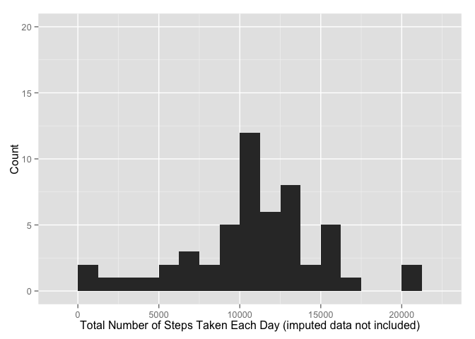
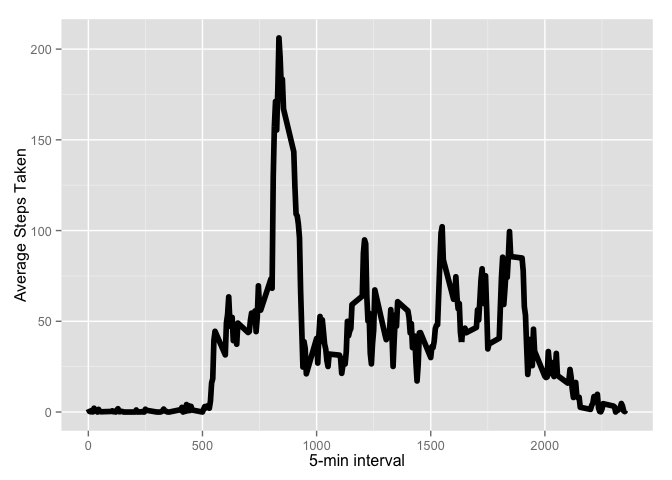
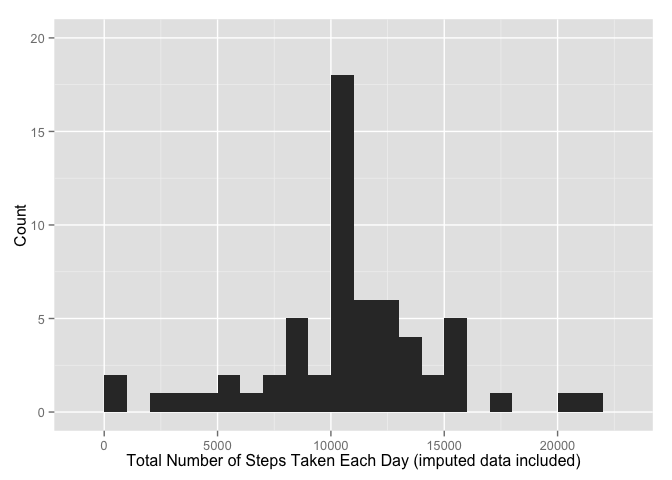
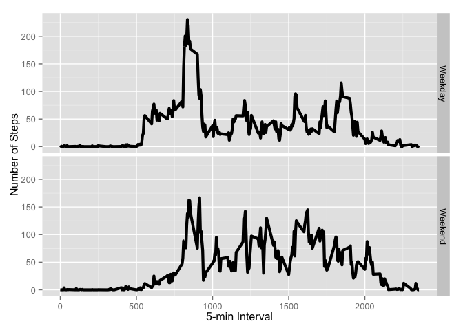

# Reproducible Research: Peer Assessment 1
IMR  
14 September, 2015  

## Initializing Libraries

In this analysis we will leverage the following libraries: 'dplyr', 'ggplot2', 'knitr' and 'lubridate'.


```r
library('dplyr') #load preferred data manipulation/wrangling library
```

```
## 
## Attaching package: 'dplyr'
## 
## The following objects are masked from 'package:stats':
## 
##     filter, lag
## 
## The following objects are masked from 'package:base':
## 
##     intersect, setdiff, setequal, union
```

```r
library('ggplot2') #load preferred plotting library
library('knitr') #load knitr
library('lubridate') #load lubridate
```


## Loading and preprocessing the data

Author's data can be retrieved from 'https://github.com/rdpeng/RepData_PeerAssessment1'.

File 'activity.csv' was extracted to the working directory, read and stored into variable 'data' .

Then determine the variable types using 'sapply' with 'class' function.


```r
setwd('/Users/e/Documents/Coursera/Data Scientists Toolbox/RepData_PeerAssessment1')
url <- "https://d396qusza40orc.cloudfront.net/repdata%2Fdata%2Factivity.zip"
unzip(zipfile = "activity.zip")
data <- read.csv("activity.csv", header = TRUE, skip = 0)
data <-data.frame(data)
d  <- tbl_df(data) # create a readable dplyr table, just in case
sapply(data, class) # check out class of variables
```

```
##     steps      date  interval 
## "integer"  "factor" "integer"
```

There are three variables, 'steps'--an ostensibly independent, integer variable; date in the format YYYY-MM-DD read as a factor here; and a variable 'intervals' with integers in intervals of five parallel to date and restarting each day.

Change the date to a date in our data-frame using 'ymd' from library *lubridate*.


```r
data$date <- ymd(data$date)
```

Create a list of factors--one factor for each day.


```r
factor <- factor(as.character(ymd(data$date)))
```


## What is mean total number of steps taken per day?

First, use 'tapply' from the 'dplyr' package to determine the totals, by date; store in variable 'd_totals'.


```r
d_total_steps <- tapply(data$steps, factor, FUN=sum, na.rm = TRUE)
```
To determine average steps by day, calculate the mean of 'd$steps' vector, i.e. an average of averages, making certain to set na.rm = TRUE. Mean calculation should return 9354.23 and median 10395.


```r
mean_steps  <- mean(d_total_steps, na.rm = TRUE)
median_steps  <- median(d_total_steps, na.rm = TRUE)
```

#### Mean Total Steps per day: 9,354
#### Median Total Steps per day: 10,395

aggregate the sum of steps by day, rename columns for ease of use,


```r
sum_data <- aggregate(data$steps, by=list(data$date), FUN=sum, na.rm=TRUE)
names(sum_data) <- c("date", "totalsteps")
head(sum_data)
```

```
##         date totalsteps
## 1 2012-10-01          0
## 2 2012-10-02        126
## 3 2012-10-03      11352
## 4 2012-10-04      12116
## 5 2012-10-05      13294
## 6 2012-10-06      15420
```

Plot histogram, 'Total Steps per Day', using the ggplot2 graphics package.


```r
ag_d <- tapply(data$steps, data$date, FUN = sum)
qplot(ag_d, binwidth = 1250, xlab = "Total Number of Steps Taken Each Day (imputed data not included)", ylab = 'Count', , ylim = c(0, 20.0))
```

 


## What is the average daily activity pattern?

To determine what the activity pattern of an 'average' or typical day is, aggregate the count of steps by interval rather than date to get a profile of how steps are distributed throughout the days, in aggregate.


```r
ag_means <- aggregate(x = list(steps = d$steps), by = list(interval = d$interval),
    FUN = mean, na.rm = TRUE)
```

To visualize an average day, create a line plot of mean steps taken by interval with ggplot--average number of steps taken (averaged across all days) versus the 5-minute intervals.


```r
ggplot(data = ag_means, aes(x = interval, y = steps)) +
      geom_line(size = 2) +
      xlab("5-min interval") +
      ylab("Average Steps Taken")
```

 

On average across all the days in the data set, interval  835--(around 2 PM, assuming the intervals begin at midnight)--contains the maximum number of steps.  


```r
max_intvl <- ag_means[which.max(ag_means$steps), ]
table(max_intvl)
```

```
##         steps
## interval 206.169811320755
##      835                1
```

#### Interval with Highest Mean Steps: Interval 834 (2PM), 206.1698


## Imputing missing values

Fist,  calculate the total number of missing values in the data set (i.e. the total number of rows with `NA`s)--here instances of 'FALSE' in summary(no_data_days)


```r
no_data_days <-  is.na(d$steps)
summary(no_data_days)
```

```
##    Mode   FALSE    TRUE    NA's 
## logical   15264    2304       0
```

For a simple imputation strategy, replace each missing value with the mean value of its 5-minute interval.

First, create function 'impute' that returns the mean of a 5-minute interval and replaces NA.


```r
impute <- function(steps, interval) {
      filled <- NA
      if (!is.na(steps))
            filled <- c(steps)
      else
            filled <- (ag_means[ag_means$interval == interval, "steps"])
            return(filled)
}
```

Apply function 'impute', create new data frame that matches the original, but with means of intervals replacing missing values.


```r
d_with_imputed <- d
    d_with_imputed$steps <- mapply(impute, d_with_imputed$steps, d_with_imputed$interval)
```

Plot the daily totals for imputed values


```r
ag_d_with_imputed <- tapply(d_with_imputed$steps, d_with_imputed$date, FUN = sum)
qplot(ag_d_with_imputed, binwidth = 1000, xlab = "Total Number of Steps Taken Each Day (imputed data included)", ylab = 'Count', , ylim = c(0, 20.0))
```

 

Calculate mean and medial total steps.


```r
mean_steps  <- mean(ag_d_with_imputed, na.rm = TRUE)
median_steps  <- median(ag_d_with_imputed, na.rm = TRUE)
```


# Are there differences in activity patterns between weekdays and weekends?

Create a function to determine and return whether a date occurred on a weekday or weekend.


```r
day_type <- function(date) {
      if (weekdays(date) == "Sunday" || weekdays(date) == "Saturday") {
            factor("Weekend")
      } else {
            factor("Weekday")
      }
}

d_with_imputed$daytype <- mapply(day_type, as.Date(d_with_imputed$date))
```

Finally, create a panel with plots displaying the mean daily steps taken on weekdays vs. weekends.


```r
day_type_mean <- aggregate(steps ~ interval + daytype, data = d_with_imputed, mean)
ggplot(day_type_mean, aes(interval, steps)) + geom_line(size = 1.5) + facet_grid(daytype ~ .) +
    xlab("5-min Interval") + ylab("Number of Steps")
```

 

The higher mid-day spike in activity found in weekdays but not weekends notwithstanding, overall activity patterns during weekdays and weekends are similar.


